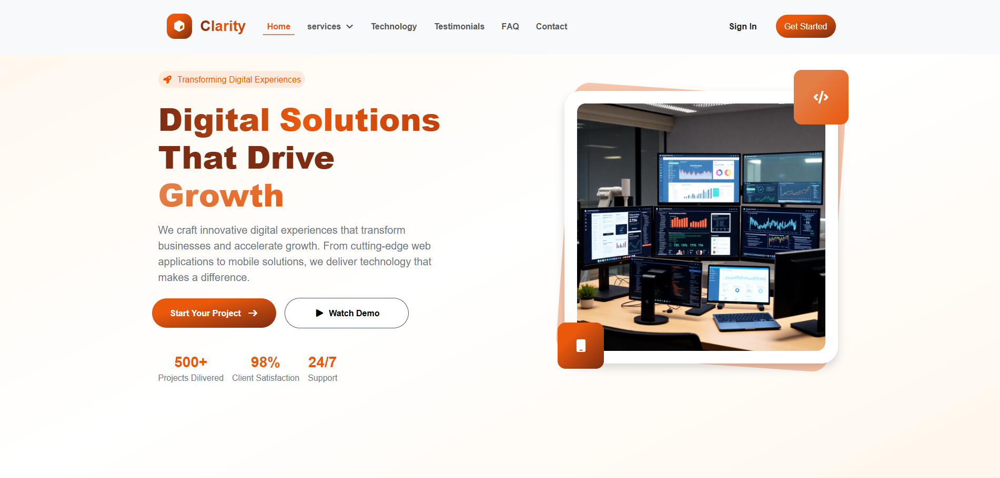
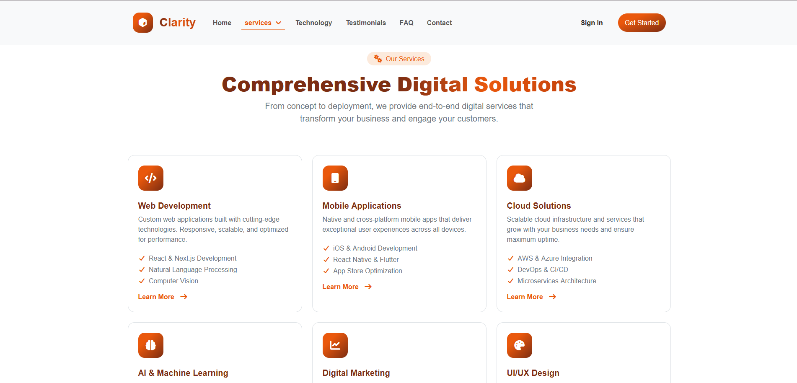
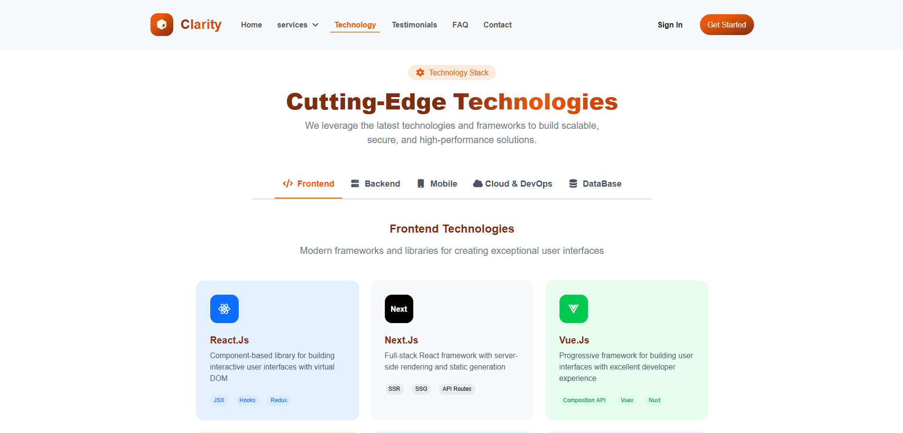
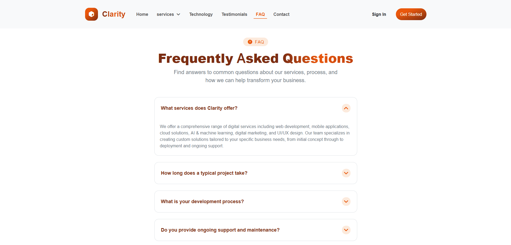
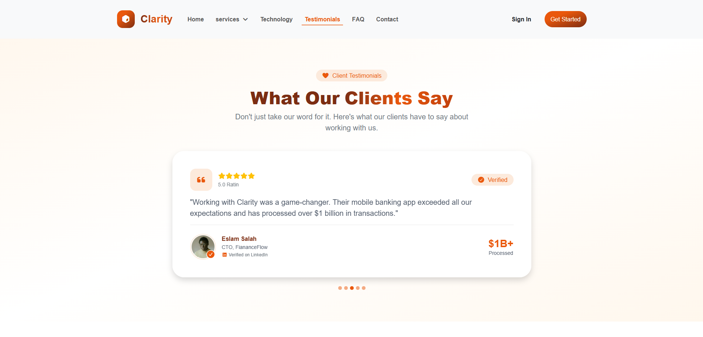

# Clarity – Digital Solutions Landing Page

A responsive multi-section landing page for a fictional digital solutions agency, built with HTML, Bootstrap 5, and custom CSS.

## Overview

Clarity is a marketing landing page showcasing a company's services, technology stack, testimonials, and contact information. It features a mega-menu navigation, a tabbed technology showcase, and a fully responsive layout powered by Bootstrap's grid system.

## Features

- **Sticky Navbar with Mega Menu** — Dropdown services menu organized into categories (Development, Infrastructure & AI, Marketing)
- **Hero Section** — Headline, call-to-action buttons, and key stats (projects delivered, client satisfaction, support)
- **Services Section** — Six service cards covering Web Development, Mobile Apps, Cloud Solutions, AI & ML, Digital Marketing, and UI/UX Design
- **Technology Stack** — Tabbed interface (Frontend, Backend, Mobile, Cloud & DevOps, Database) listing tools and frameworks per category
- **Testimonials Section**
- **FAQ Section**
- **Contact Section**
- **Scrollspy Navigation** — Active nav link updates automatically based on scroll position
- **Fully Responsive Design** — Optimized for mobile, tablet, and desktop

## Screenshots











## Tech Stack

- HTML5
- Bootstrap 5 (Grid, Scrollspy, Tabs, Dropdown, Collapse components)
- Custom CSS (`css/style.css`)
- Font Awesome (icons)
- Vanilla JavaScript

## Project Structure

landing-page-clarity/
├── Js/ # JavaScript files
├── css/ # Stylesheets (Bootstrap + custom style.css)
├── font/ # Font files
├── imgs/ # Images and icons
└── index.html # Main page

## Getting Started

1. Clone the repository:
```bash
   git clone https://github.com/shahendamohamed22/landing-page-clarity.git
```
2. Open `index.html` in your browser — no build step or server required.

## Live Demo

 https://shahendamohamed22.github.io/landing-page-clarity/

## Author

**Shahenda Mohamed**
GitHub: [@shahendamohamed22](https://github.com/shahendamohamed22)


